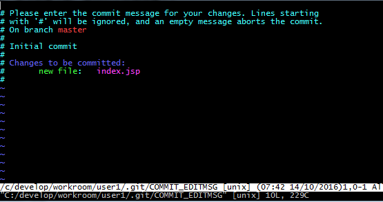
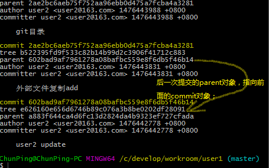
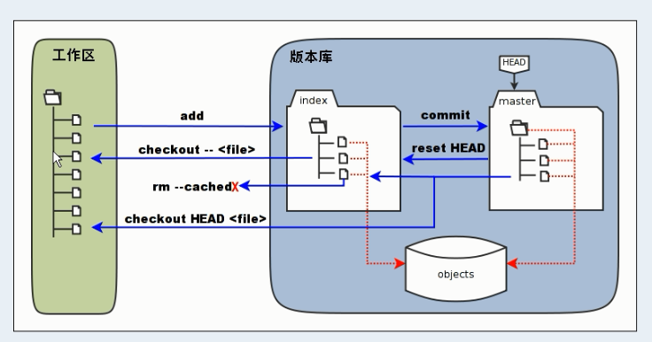

# git的使用

## git的安装与配置
请参阅[windows安装git和环境变量的配置](https://wuzhuti.cn/2385.html)

## 版本管理员的操作
1. 初始化中央仓库[实验链接](./02.Git 暂存区的理解.mhtml)
+ 创建一个目录 c:\develop\software\repository\git 用于存放版本库
- 在目录下运行命令 $ git init --bare shared.git

2. 将中央版本库，克隆到本地
+ 创建一个目录 c:\develop\workroom\user1 与 c:\develop\workroom\user2 用于存放本地版本库；
- 在目录下运行 $ git clone /c/develop/software/repository/git/share.git . (注意有个点，表明当前目录)
- 克隆之后，有可能看不到，是因为文件被隐藏了；

3. 设置个人信息

git config user.name "user1"
git config user.email "user1@163.com"

> 利用 ls (-al) 查看目录 cd (打开目录) cat (打开文件) cd ..（返回上一级） clear (清空控制台) 查看配置文件 看个人信息是否设置成功

4. 在 .git 同级目录下，新建一个文件

echo "User1 add content" > index.jsp 

5. 提交文件

git add index.jsp 追踪文件 将文件添加到缓存区；

git commit 提交文件 会进到一个 vim 窗口来强制用户提交本次改动信息

[vim命令图解](http://jingyan.baidu.com/article/48206aeaf07f37216ad6b3a6.html)：

 
> commit 是将文件提交到，本地版本库里面；

git commit -m "User1 add the file"

6. 把自己的仓库提交到公共服务器

git push origin master  
> 'origin' 这个本地库是从那地方 clone 出来的，这个origin 便指向哪里；

7. git 常用命令
- $ pwd 可以看到自己当前所在的目录位置
- $ ls -al 查看所有的目录 （包含隐藏的目录）
- $ vim text 打开vim 编辑器 编辑指定文件；
- $ git log --pretty=raw 查看完整日志 （紧接着按‘q’退出输入模式）
- $ git log --graph 查看日志 每个动作都有对应的哈希值

- $ git get-file -t 当自己拿到一个哈希值时 用于查看哈希值指代的对象类型
- $ git get-file -p 看哈希值指向对象内的具体内容

8. checkout使用详解
[checkout使用详解](http://www.cnblogs.com/hutaoer/archive/2013/05/07/git_checkout.html?utm_source=tuicool&utm_medium=referral)

## git的相关概念

### 工作区
### 暂存区
### 版本库
 

***

# TortoiseGit的使用

## Tortoise的安装及配置

## Tortoise的使用
+ 创建空的'中央版本库' 
    右键-->git creat repository here..
+ clone 中央版本库到本地仓库
    右键-->git clone
+ 在.git 平级目录下新建一个文件

+ 配置程序员信息
    右键--TortoiseGit--setting--Git 
+ 提交文件 至本地仓库
    右键文件--add--commit--输入注释--success
+ 推送文件至中央仓库
    右键--TortoiseGit--push 
> 将push按钮 配置到tortoiseGit第一面 右键--TortoiseGit--setting--context menu

+ 若有人比自己本地先提交，且与自己本地库有冲突；
1. 先将中央版本库的文件 Pull 下来；与手动将自己本地文件整合在一起；
2. 右键文件-- TortoiseGit -- Edit conflicts
 
git 就是不知道该怎样处理，所以才会交给程序员去处理，但cinflicts 处理完之后，git不知道
得去通知git conflicts已经处理完毕； 
右键 -- TortoiseGit -- resolve 

## vscode 使用git 教程

## 如何管理好自己的包包

- 由于`Node`本身并没有太多的功能性`API`，所以市面上涌现出大量的第三方人员开发出来的`Package`

- 包的生态圈一旦繁荣起来，就必须有工具去代替人脑或者文档的方式管理
- 这时候`NPM`诞生了
